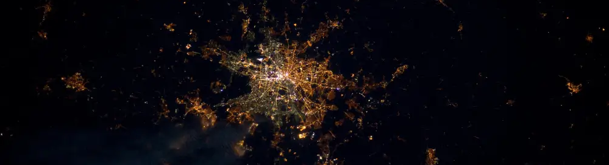

```{r setup, include=FALSE}
knitr::opts_chunk$set(echo = TRUE)
```


<style type="text/css">

body{ /* Normal  */
      font-size: 20px;
      text-align: left;
  }

code.r{ /* Code block */
    font-size: 12px;
}
pre { /* Code block - determines code spacing between lines */
    font-size: 12px;
}
</style>

<p style="line-height:3">

<br>


<p style="text-align:right">
<font size="3"> 
Source: ESA
</font> 
</p>

<font size="4"> 

<p style="text-align:justify">
Here's a list with some resources for spatial data that I have used in my research. </p>

---

#### **Nightlights**

+ VIIRS (since 2012) https://ngdc.noaa.gov/eog/viirs/download_dnb_composites.html
+ DMSP-OLS (1992-2013) https://ngdc.noaa.gov/eog/dmsp/downloadV4composites.html


***
#### **Geocoded Surveys**
+ Afrobarometer https://www.afrobarometer.org/
+ Demographic and Health Survey (DHS) https://dhsprogram.com/
+ World Bank LSMS http://surveys.worldbank.org/lsms/about-lsms

***
#### **Geographic Variables**
+ Ruggedness https://diegopuga.org/data/rugged/
+ Caloric Suitability Index https://ozak.github.io/Caloric-Suitability-Index/
+ Elevation (NASA) https://cgiarcsi.community/data/srtm-90m-digital-elevation-database-v4-1/
+ Land Cover http://maps.elie.ucl.ac.be/CCI/viewer/index.php
+ Precipitation and Temperature http://chelsa-climate.org/downloads/
+ Malaria Ecology Index from the paper Kiszewski et al (2004) shared by Gordon McCord
\  https://gps.ucsd.edu/_files/faculty/mccord/mccord_research_malaria-index.zip

***
#### **Country Shapes (including Admin-1 and -2)**
+ GADM https://gadm.org/data.html
+ GAUL https://data.apps.fao.org/map/catalog/srv/api/records/9c35ba10-5649-41c8-bdfc-eb78e9e65654

***
#### **Population Grid**
+ Worldpop https://www.worldpop.org/doi/10.5258/SOTON/WP00004
+ UNEP Sioux Falls https://na.unep.net/siouxfalls/datasets/datalist.php

***
#### **Cities**
+ https://www.africapolis.org

***
#### **Ethnic Maps Africa**
+ Murdock Maps http://worldmap.harvard.edu/data/geonode:Murdock_EA_2011_vkZ
+ GREG http://worldmap.harvard.edu/data/geonode:GREG_0vV

***
#### **Conflict Data**
+ Uppsala Conflict Data Program https://ucdp.uu.se/
+ Acled https://www.acleddata.com/
+ Ethnic Power Relations (ETH) https://icr.ethz.ch/data/epr/

***
#### **Satellite Imagery**
+ Google Earth Engine https://developers.google.com/earth-engine/datasets/
+ Sentinel 2 (ESA) https://sentinel.esa.int/web/sentinel/missions/sentinel-2
+ Landsat (USGS) https://www.usgs.gov/land-resources/nli/landsat/landsat-data-access?qt-science_support_page_related_con=0#qt-science_support_page_related_con

***
#### **Landcover Grids < 30m**
+ Global Human Settlement Layer (GHSL) https://ghsl.jrc.ec.europa.eu/download.php
+ Global Urban Footprint (GUF) https://www.dlr.de/eoc/en/desktopdefault.aspx/tabid-11725/20508_read-47944/
+ ESA African land cover https://www.esa.int/ESA_Multimedia/Images/2017/10/African_land_cover
+ NASA Cropland https://earthdata.nasa.gov/esds/competitive-programs/measures/gcad30-through-landsat-and-modis
+ Facebook, CIESIN \& World Bank High Resolution Settlement Layer https://ciesin.columbia.edu/data/hrsl/

***
#### **Resources and Mining**
+ USGS https://mrdata.usgs.gov/
+ World Resources Institute https://www.wri.org/resources

***
#### **Further Data Collections**
+ WorldGeoDatasets http://www.worldgeodatasets.com/basemaps/index.html
+ AIDDATA https://www.aiddata.org/datasets
+ PCA https://platform.princetonclimate.com/PCA_Platform/index.html 
+ data|in|space https://datainspace.org/
+ Free GIS data https://freegisdata.rtwilson.com/
+ UPenn GIS Global https://guides.library.upenn.edu/globalgis
+ GDELT https://www.gdeltproject.org/data.html

<br>

***
#### **Software**
<p style="text-align:justify"> R is a wonderful programming language for data manipulation and statistical programming. R is also extremely powerful when it comes to spatial data. The main packages for GIS in R to get familiar with are [**sp**](https://cran.r-project.org/web/packages/sp/sp.pdf) for vectorized representations of spatial data and [**raster**](https://cran.r-project.org/web/packages/raster/raster.pdf) for spatial grids. The [**sf**](https://cran.r-project.org/web/packages/sf/sf.pdf) package is certainly also worth mentioning and can be considered a new and improved version of sp. But there are many more useful packages and their number is constantly growing. Here are some links to tutorials to get you started with GIS in R:</p>

+ http://www.nickeubank.com/gis-in-r/
+ https://www.jessesadler.com/post/gis-with-r-intro/
+ https://www.rspatial.org/

</font>